# Cadastro de Pessoas Beneficiadas

Este tutorial orienta o cadastro de **Pessoas Beneficiadas** no SIGAMA e explica como essas opções são usadas no **Termo de Atividade**.

As Pessoas Beneficiadas são parâmetros utilizados no campo **Adicionar Público Beneficiado** do Termo de Atividade. Elas ajudam a padronizar os registros de ações realizadas e evitam preenchimentos duplicados ou inconsistentes.

:::info[Acesso restrito]
O cadastro, a ativação e a inativação de Pessoas Beneficiadas são funcionalidades restritas a usuários vinculados ao setor de **Educação Sanitária**.
:::

## Quando usar

Use este cadastro para:

- Padronizar os públicos beneficiados disponíveis no Termo de Atividade.
- Facilitar o preenchimento dos termos pelos servidores.
- Manter consistência nas informações registradas.
- Controlar quais opções aparecem como ativas no sistema.

## Acessar a tela de Pessoas Beneficiadas

No menu principal do SIGAMA, acesse:

**Fiscalização > Pessoas Beneficiadas do Termo de Atividade**

URL direta:

```text
https://sigama.aged.ma.gov.br/fiscalizacao/pessoas-beneficiadas-termo-atividade
```

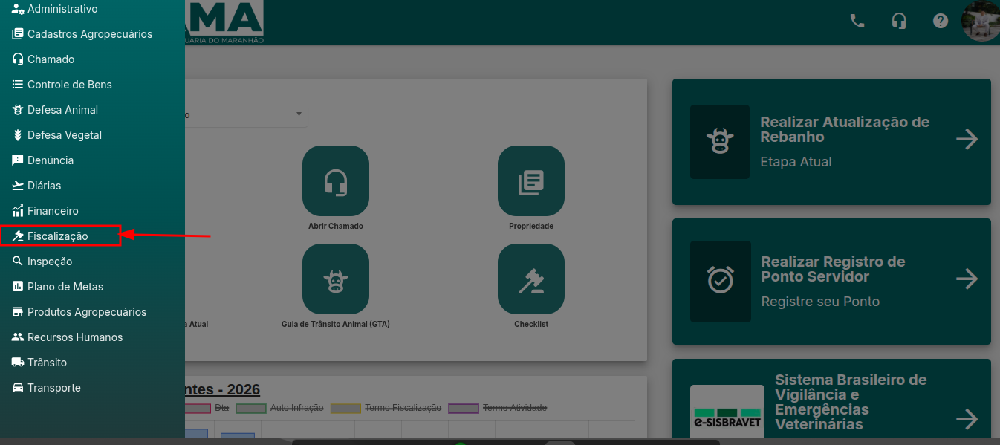

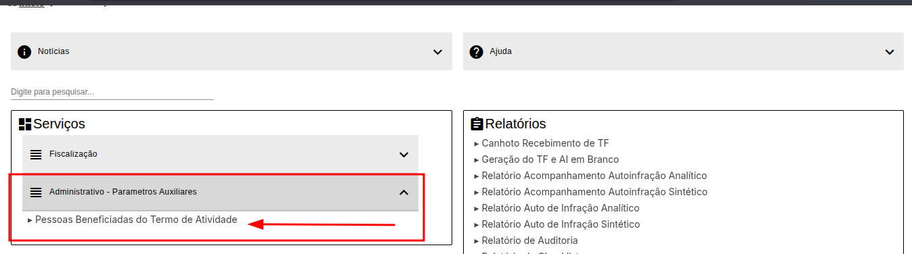

## Cadastrar uma nova Pessoa Beneficiada

### 1. Iniciar o cadastro

Na tela de listagem, clique no botão **Inserir (+)** na parte superior da tela.

URL direta:

```text
https://sigama.aged.ma.gov.br/fiscalizacao/pessoas-beneficiadas-termo-atividade/inserir
```

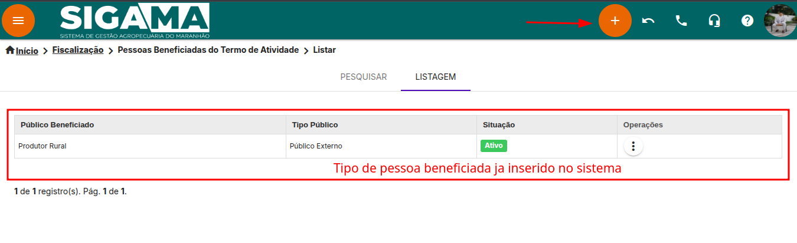

### 2. Preencher os campos obrigatórios

Preencha todos os campos exibidos na tela:

| Campo | Como preencher |
| --- | --- |
| **Público Beneficiado** | Informe o nome do público beneficiado. Exemplos: Produtor Rural, Médico Veterinário, Engenheiro Agrônomo. |
| **Tipo Público Beneficiado** | Selecione se o público é **interno**, **externo** ou aplicável a ambos, conforme as opções disponíveis no sistema. |

O campo **Tipo Público Beneficiado** será usado como filtro quando o usuário adicionar públicos beneficiados no Termo de Atividade.

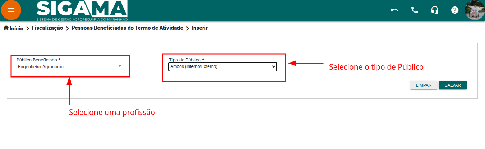

### 3. Salvar o cadastro

Após conferir as informações, clique em **Salvar**.

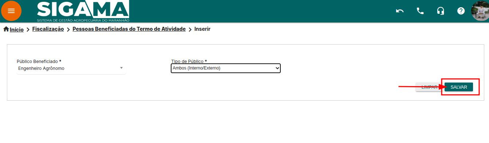

Quando o sistema exibir a mensagem de sucesso, clique em **OK** para retornar à listagem.

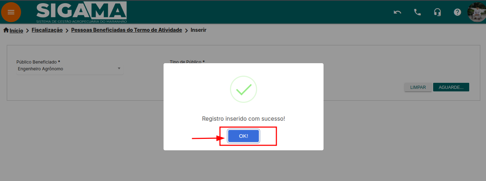

## Inativar uma Pessoa Beneficiada

Inative um registro quando ele não deve mais aparecer como opção no Termo de Atividade.

:::warning[Atenção]
Somente Pessoas Beneficiadas com situação **Ativa** aparecem para seleção no Termo de Atividade.
:::

Na listagem, localize o registro com situação **Ativo**, abra o menu de operações e selecione a opção de inativação.

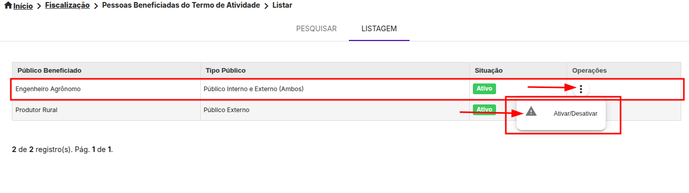

Na janela de confirmação, clique em **Confirmar** e aguarde a atualização do sistema.

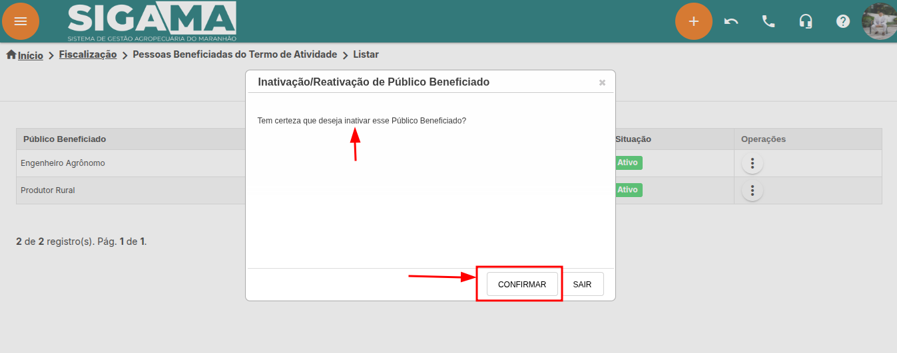

Após a confirmação, o registro passa a aparecer como **Inativo** na listagem.

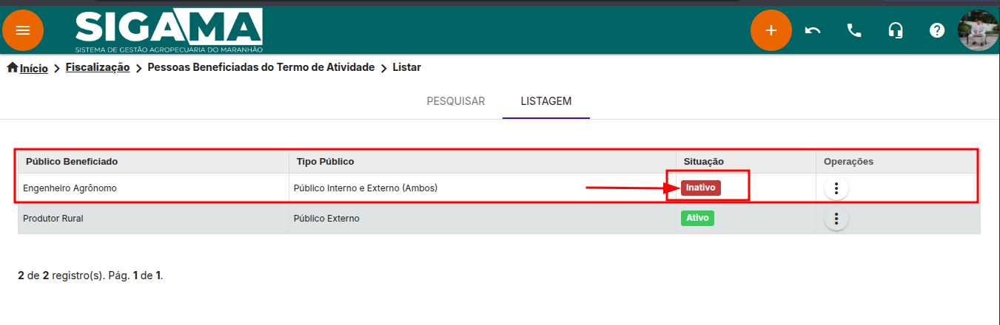

## Ativar uma Pessoa Beneficiada

Ative um registro quando ele deve voltar a aparecer como opção no Termo de Atividade.

Na listagem, localize o registro com situação **Inativo**, abra o menu de operações e selecione a opção de ativação.

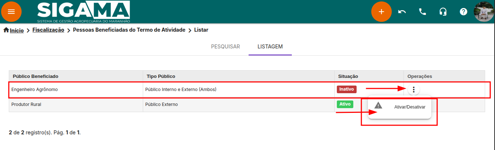

Na janela de confirmação, clique em **Confirmar** e aguarde a atualização do sistema.

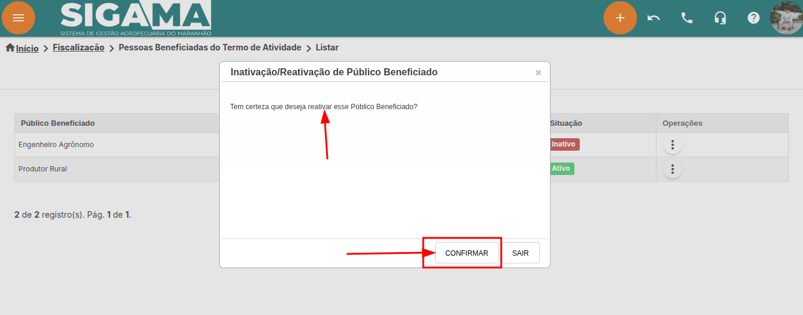

Após a confirmação, o registro volta a aparecer como **Ativo**.

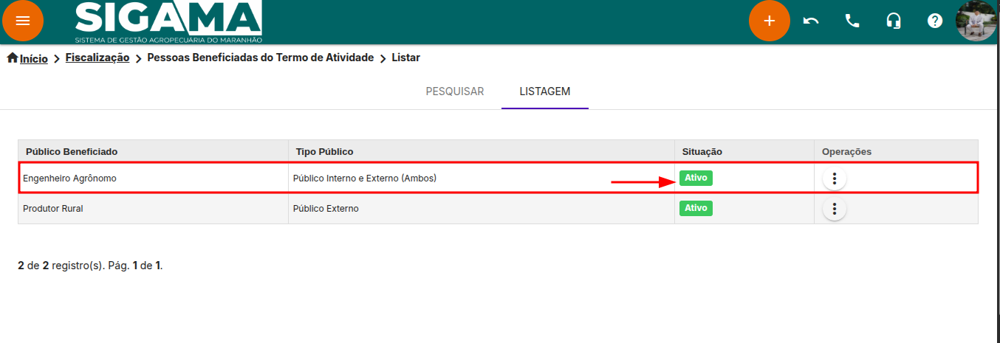

## Utilizar no Termo de Atividade

Depois do cadastro, as Pessoas Beneficiadas ficam disponíveis no módulo de **Termo de Atividade**.

Durante o preenchimento do termo, localize a seção **Objetivo e Público** e clique em **Adicionar Público Beneficiado**.

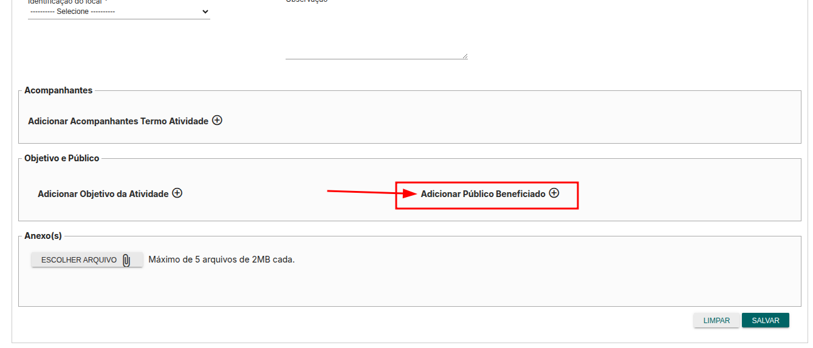

Na janela **Público Beneficiado**, preencha os campos obrigatórios:

| Campo | Finalidade |
| --- | --- |
| **Tipo Público Beneficiado** | Filtra os públicos cadastrados por tipo. |
| **Público Beneficiado** | Lista os públicos cadastrados conforme o tipo selecionado. |
| **Quantidade de Pessoas Atendidas** | Registra o número de pessoas beneficiadas pela atividade. |

Depois de preencher os dados, clique em **Confirmar**.

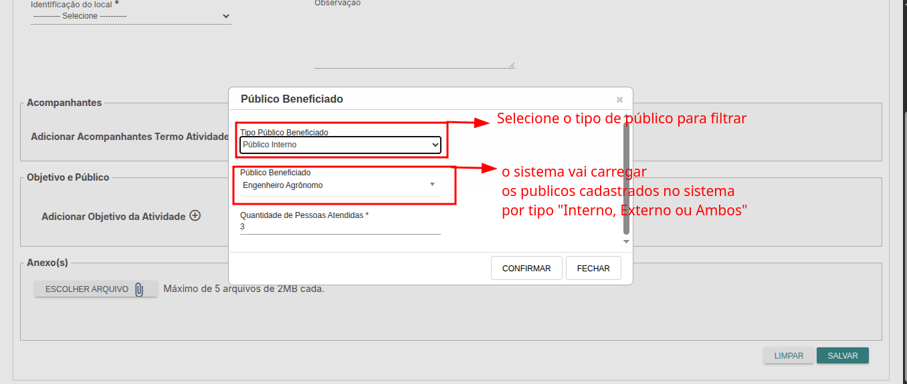

## Boas práticas

- Use nomes claros e objetivos.
- Evite cadastrar públicos duplicados.
- Mantenha ativos apenas os registros em uso.
- Revise as informações antes de salvar.
- Inative registros antigos em vez de criar variações desnecessárias.

## Possíveis problemas

| Situação | Causa provável | O que fazer |
| --- | --- | --- |
| Uma opção necessária não aparece no cadastro do termo | O público ainda não foi cadastrado ou está inativo | Verifique a listagem e cadastre ou reative o registro. |
| Um público cadastrado não aparece no Termo de Atividade | O registro está com situação **Inativo** | Reative o registro na tela de Pessoas Beneficiadas. |
| O tipo de público não filtra a opção esperada | O cadastro foi associado ao tipo incorreto | Revise o campo **Tipo Público Beneficiado** do registro. |

## Conclusão

O cadastro correto de Pessoas Beneficiadas garante que os Termos de Atividade sejam preenchidos com informações padronizadas, consistentes e rastreáveis.
