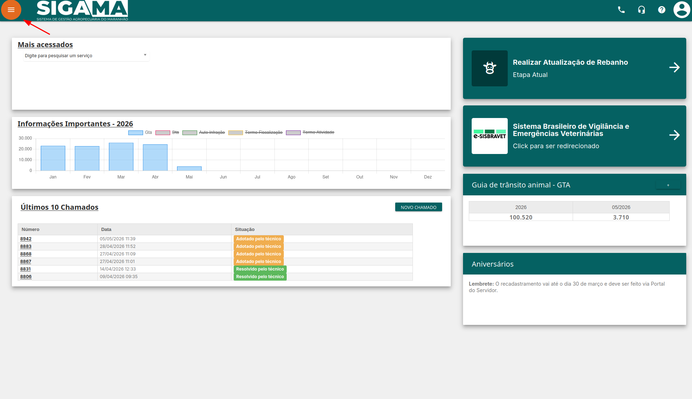
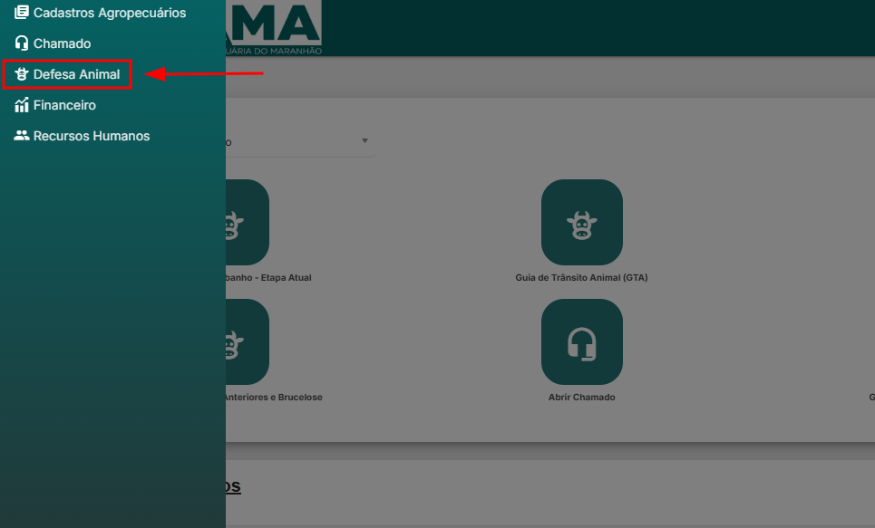
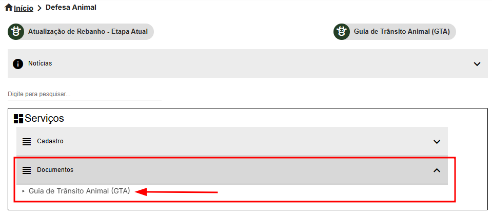
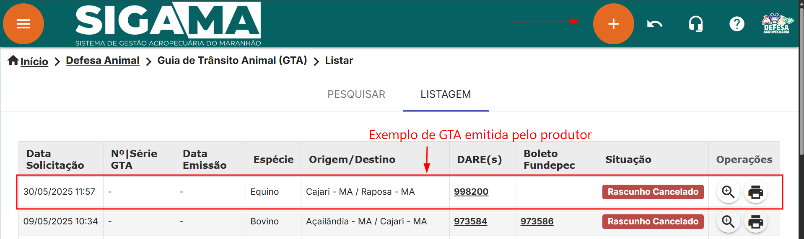
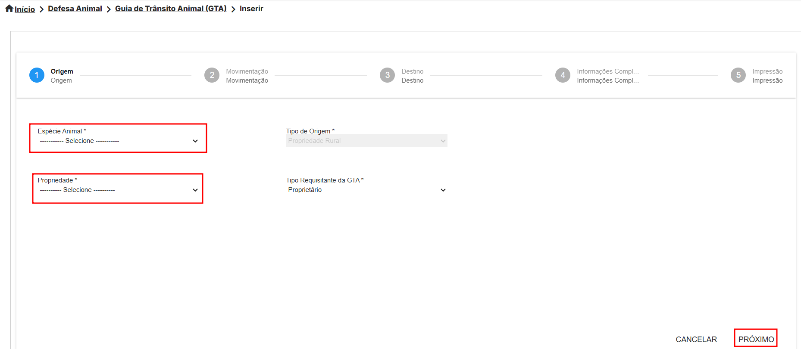
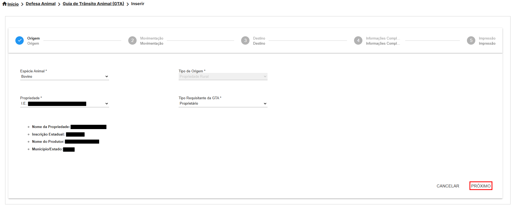
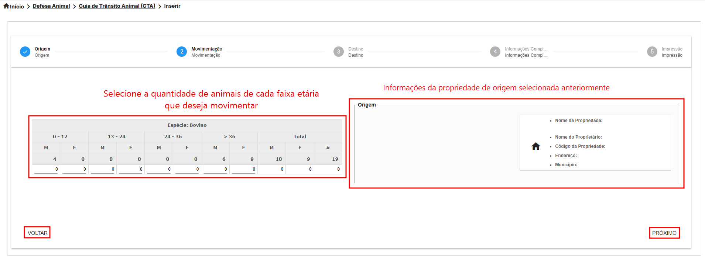
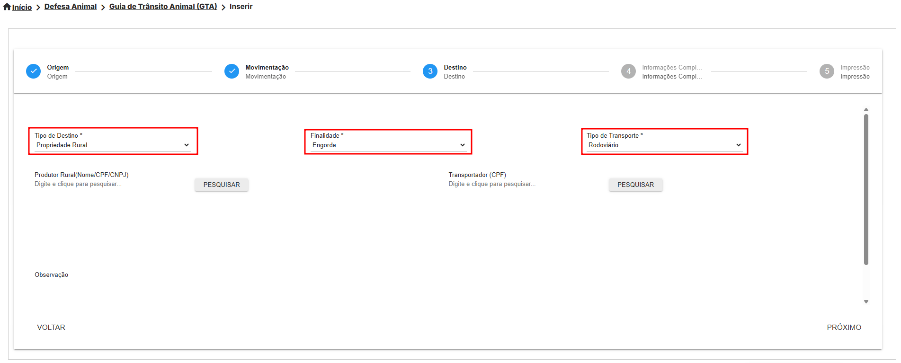

# Emissão de GTA

Este tutorial orienta o produtor rural a emitir a **Guia de Trânsito Animal (GTA)** pelo próprio acesso no SIGAMA.

## O que é a GTA

A **Guia de Trânsito Animal (GTA)** é um documento obrigatório para o transporte de animais vivos, ovos férteis e outros produtos de origem animal. Ela garante a sanidade do rebanho e a rastreabilidade dos animais.

## Antes de começar

Antes de iniciar a emissão, verifique se:

- A propriedade de origem está cadastrada e regular no SIGAMA.
- A exploração pecuária está vinculada ao produtor.
- As informações sanitárias exigidas para a espécie estão atualizadas.
- Você sabe a quantidade de animais por sexo e faixa etária.

## Acessar a tela de GTA

Na tela inicial do SIGAMA, acesse:

**Defesa Animal > Documentos > Guia de Trânsito Animal (GTA)**

URL direta:

```text
https://sigama.aged.ma.gov.br/defesa-sanitaria-animal/gta
```







## Iniciar uma nova GTA

Na tela de listagem, o sistema mostra as 100 últimas GTAs emitidas pelo produtor, da mais recente para a mais antiga.

Para iniciar uma nova emissão, clique no botão **Inserir (+)** na parte superior da tela.

URL direta:

```text
https://sigama.aged.ma.gov.br/defesa-sanitaria-animal/gta/inserir
```



## Preencher as informações de origem

Na primeira etapa da emissão, preencha os dados de origem da movimentação.

| Campo | Como preencher |
| --- | --- |
| **Espécie Animal** | Informe a espécie que será movimentada, como bovino, bubalino ou equídeo. |
| **Propriedade** | Selecione a propriedade de origem que possui exploração cadastrada para o produtor. |
| **Próximo** | Após preencher os dados e aguardar o carregamento das informações, avance para a próxima etapa. |



## Confirmar os dados carregados

Depois de selecionar a espécie e a propriedade, aguarde os dados aparecerem na tela.

Confira as informações apresentadas e clique em **Próximo**.



## Inserir a movimentação

Na etapa de movimentação, informe a quantidade de animais conforme sexo e faixa etária.

| Área da tela | Finalidade |
| --- | --- |
| **Tabela de movimentação** | Informe as quantidades nas linhas correspondentes às faixas etárias. |
| **Quadro de origem** | Exibe as informações da propriedade de origem. |
| **Voltar** | Retorna para a etapa anterior. |
| **Próximo** | Avança para a próxima etapa após o preenchimento correto. |

No exemplo do manual, para bovinos, foram informados animais por sexo e idade até compor o total da movimentação.



## Informar os dados iniciais de destino

Na etapa de destino, informe o tipo de destino que receberá os animais.

Para produtor rural, o sistema pode apresentar opções como:

- Propriedade rural.
- Aglomeração.
- Marchante.
- Interestadual.

Preencha os campos exigidos na tela conforme o destino da movimentação.



## Conferir antes de emitir

Antes de finalizar a emissão, revise:

- Espécie selecionada.
- Propriedade de origem.
- Quantidade de animais por sexo e faixa etária.
- Tipo de destino.
- Dados do destino da movimentação.

:::warning[Atenção]
A GTA tem validade limitada. Verifique o prazo conforme a finalidade e as regras aplicáveis à movimentação.
:::
